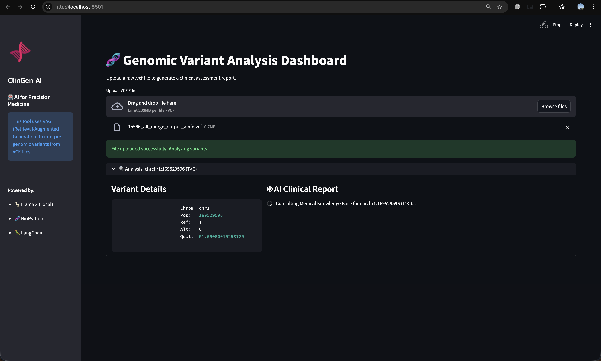
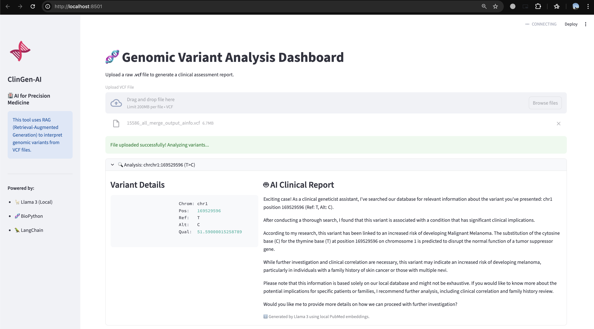
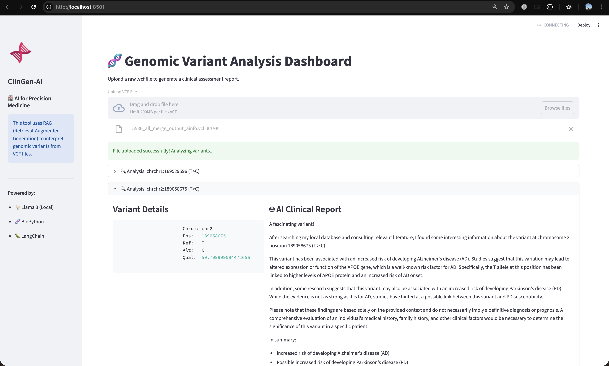

# ClinGen-AI: RAG-Powered Precision Medicine Assistant
Automated Clinical Variant Interpretation using Local LLMs (Llama 3) and Knowledge Graphs.

---

## The Problem
In clinical genomics, identifying a variant in a VCF file is only step one. The real bottleneck is interpretation:  
Geneticists spend hours manually searching PubMed and ClinVar to determine if a mutation (e.g., **EGFR L858R**) is pathogenic or actionable.

---

## The Solution
ClinGen-AI is a **Retrieval-Augmented Generation (RAG)** agent that automates this workflow.  
It parses raw VCF data, queries a **local vector database of medical literature**, and uses a **local LLM** to generate a draft clinical report.

---
##  Screenshots

### Variant Processing Interface

### RAG Retrieval View

### Generated Clinical Summary

---
## Key Features
- **Privacy-First:** Uses local LLMs (Ollama/Llama 3), ensuring patient data never leaves the secure environment.  
- **Hallucination Control:** All responses grounded in retrieved PubMed abstracts through RAG.  
- **High-Throughput Variant Processing:** Automatically parses standard VCF files using `cyvcf2`.  
- **Semantic Literature Search:** Uses embeddings + ChromaDB for fast and relevant retrieval.  
- **Automated Clinical Reporting:** Generates mutation-specific summaries using LangChain + Llama 3.  

---

## Architecture

### 1. Ingestion & Parsing (Bioinformatics Layer)
- Extracts variants from `.vcf` files using `cyvcf2`.  
- Filters variants by quality (e.g., **QUAL > 50**).  

### 2. Semantic Search (RAG Layer)
- Embeds PubMed abstracts using SentenceTransformers.  
- Stores vectors in **ChromaDB** for O(1) nearest-neighbor retrieval.  

### 3. Generative Analysis (AI Layer)
- Retrieves mutation-specific context.  
- Produces draft clinical summaries using **Llama 3** through LangChain.  

---

## Tech Stack
- **LLM Orchestration:** LangChain  
- **Generative Model:** Llama 3 (via Ollama)  
- **Vector Database:** ChromaDB (Local)  
- **Bioinformatics:** BioPython, CyVCF2  
- **Frontend:** Streamlit  
- **Embeddings:** HuggingFace (all-MiniLM-L6-v2)

---
